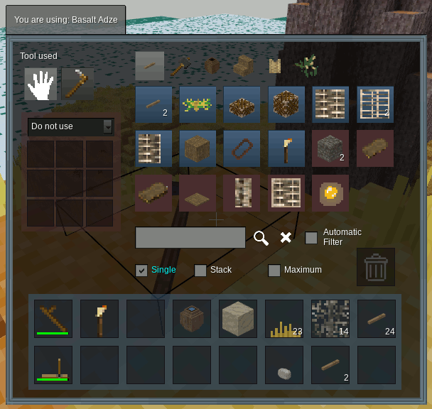

# Crafting Mod

Adds semi-realistic crafting with unlockable recipes to Minetest,
Craft grid becomes optional

Based on rubenwardy's mod but heavily modified for Exile.  
**WARNING : not compatible with original mod anymore**

License: LGPLv2.1+



## Image Licenses

rubenwardy (CC BY-SA 3.0):
  crafting_slot_*.png

Neuromancer (CC BY-SA 3.0):
  crafting_furnace_*.png

BlockMen (CC BY-SA 3.0):
  gui_*.png

paramat (CC BY-SA 3.0)
  creative_trash_icon.png  (derived from a texture by kilbith, same license)

## Limitations

Any recipes must be designed such that any particular item can only be used
as one of the ingredients.

For example, you can't have the following recipe, as `default:wood` could
be used twice: `default:wood, group:wood`.

## API documentation

### Groups

* crafting.**get_group_items**(`g_name`)
    > Returns a list of all registered items being in that group
    >* `g_name` is the group's name

* crafting.**register_group_desc**(`name`, `desc`)
    > Registers groups description

* crafting.**get_group_stats**(`grouptag`)

    > Returns a table of fields extracted from given string `grouptag`
    >* `grouptag` is a string to be used in recipes Format is:   
    >       
    >       "group:<groupname>&<groupnumcondition>/<unit> <count>"
    >
    > where:  
    >    * `groupname` is mandatory name of the group.
    >    * *(optional)* `groupnumcondition` is required group's number (ex: `"3"`) or condition (ex: `">2"` or `"<6"`)  
    >    * *(optional)* `unit`  is the unit required (will be testes as second group).
    >    * *(optional)* ` count` is the count of the ItemStack  
    > Ex:    
    >    
    >          "group:freshwater&1/pot 2"
    >
    > Stands for *"I want 2 items with group "freshwater=1" and group "pot" as unit.*
    >
    > Returned table had following fields:
    >    * `name` the name of the group (groupname). Ex: "freshwater"
    >    * `tag` is "group:" .. name, without the ItemStack count.   
    Ex: "group:freshwater&1/pot"
    >    * `num_cmd` (can be nil !) condition ">" or "<".  
    if no command, defautl condition is "="
    >    * `num` (can be nil !) required group number
    >    * `does_match`  is a function
    >        * parameters are `self`, `item_name`, *(optional)* `item_groups`)  
    >        * returning `true` if item matches that grouptag, `false` else.
    >    * `unit` if present is the given unit. Ex: "pot"
    >    * `name_desc` description of the name part
    >    * `unit_desc` description of the unit part
    > Both are generated if group description was not registered
    >    * `desc` full description of the group, for recipe tooltip


### Crafting types

* crafting.**register_type**(`name`, `label`, `icon_item_name`, `sound`)
	> Register a type `type` used for tabs and recipes sorting
    >    * `name`  - name of the type in code
    >    * `label` - label of the type displayed in game. Translated
    >    * `icon_item_name` - used to be displayed in tab in crafting formspec
    >    * `sound` - sound made when we craft this type
    >    * `recipes` - array of possible recipes for that crafting type, assigned to {} at registration.

* crafting.**reset_craft_types**()
    > Deletes all registered craft types

* crafting.**is_type_registered**(`name`)
    > Returns `true` if type is already registered, `false` else.

* crafting.**get_type**(`name`)
    > Returns the type's table   
    See [`crafting.register_type`](#crafting-types) for the fields

* crafting.**get_recipes_by_type**(`name`)
    > Returns the liste of all recipes having that craft type
    >*  It is the same as `crafting.get_type(name).recipes`
    >*  Returns `nil` if `name` is not a registered craft type

* crafting.**get_registered_types_names**()
    > Returns an array of all registered craft types names

### Recipes

* crafting.**get_recipes**()
    > Get global recipes table, with id as index

* crafting.**get_recipe**(id)
	> Get recipe by ID

* crafting.**get_unlocked**(`name`)
    > Returns a dictionary of recipe output to boolean.
	>* `name` is the player's name

* crafting.**lock_all**(`name`)
    > * `name` is the player's name

* crafting.**unlock**(`name`, `v`)
	>* `name` is the player's name
	>* `v` is a single output or list of outputs

* crafting.**register_recipe**(`def`)

    > Generate a `recipe` object table from `def` and stores it in `recipes_by_id` table
    >* returns `id`
	>* `def` a table with the following fields:   
	>   * `type`   - one of the registered types.  
	>   * `output` - the result of the craft, eg: `default:stone 3`.
	>   * `items`  - A list of ingredients, eg: `{"stone", "wood 3"}`.  
    >   It can also be a grouptag, or a table with `recipe_item` format.
    >   * `tool`   - An item used as tool (not consumed), eg: `"nodes_nature:sand"`.  
    >                 **WARNING: we curently can use only one tool**
	>   * `level`  - level of station required.`1` by default
	>   * `always_known` - If `true`, this recipe will never need to be unlocked. `true` by default
    >   * `replace` - A string, table or function used to give back items when crafting.
    >    * `sound` - sound to be played when we use that recipe. Overrides default crafting type sound.
    >    * `_display` - string of image to display in recipe panel. This is needed to override default one taken from output's item.  
    >
    > `output`, `type` and `items`  are mandatory, the other ones are optionals.     
    >
    > Generated `recipe` object has the same fields, except
    >* `items` and `tool` fields are modified after mods load to be `recipe_item` objects.
    >* It inherits function from  [`recipe_funcs`](#recipe-functions)


#### Recipe's `item` object
####

  * `item` is a table with following fields:

     * `name` = name of the item
     * `gstats` = groups stats if item is a group, nil else
     * `description` = description of the item
     * `short` = description of the item to be displayed in recipe panel
     * `need` = the number we need for the recipe


 It inherits functions from `item_funcs` table (see below)

   * `item_funcs`:**get_items_names** (`save_list`)

       > Returns a list of all item names matching this input
       >* `save_list` is an optional list: if given, item will be added to that list. Else, a new list will be created and returned.

   * `item_funcs`:**get_have** (`item_hash`)
       > Returns how many ItemStacks matches with our `recipe_item` in `item_hash`
       >* doesn't update the item
       >* `item_hash` needs to match format of [crafting.set_item_hash_from_list](#item_hash_format)

   * `item_funcs`:**take** (`input_stack`, `still_needed`)
        > *unused yet*
        >*  `input_stack` is and ItemStack (or string ?) we want to sue to match our `recipe_item`.
        >* `still_needed` is how much we still need of this item to have enough for craft
        >* Returns 2 parameters:  
        >    1. found ItemStack matching `recipe_item` in `input_stack`
        >    2. updated `still_needed` count
        >* doesn't update the item
        >* `item_hash` needs to match format of [crafting.set_item_hash_from_list](#item_hash_format)  


Additionnal functions can be used if added in recipe's registration  
(will be `nil` by default in `recipe_item`)

   * `recipe_item`:**get_tooltip** (`have`)
        > Returns the string to be displayed in recipe's tooltip for that item (color included)
        >* `have` is the count of ItemStack we have available to use


<a id="recipe-functions"></a>
#### `recipe_funcs` functions
####

* `recipe_funcs`:**available_level** (`player_level`)
    > Returns `true` if `player_level >= recipe.level`

* `recipe_funcs`:**find_max_craftable**(`item_hash`)
    > Find maximum number of times we can craft that recipe using `item_hash`
    >* `item_hash` needs to match format of [crafting.set_item_hash_from_list](#item_hash_format)
    >* Returns 2 values:  
    >    1) The max count (number)  
    >    2) A states table with following format :   
    >
>               {  
                 tool = { have = number I have },
                 items = {
                           {
                             have = number I have,
                             max = max I can validate
                            }
                          }
                }


### Player_recipes

####  `player_recipe` Object

This is meant to have a custom recipe object per player, so we can change craftable/possible state, without impacting registered recipe.

* `player_recipe` is a table with following fields generated on creation:

    * `recipe` = recipe's defintion as registered
    * `pr_items` = table of input items, each item beeing a table with following format :

        * `def` = item as in recipe's registration  
        *+ acces functions to avoid accidentally update original recipe:*
        * `get_name`() = function to acces the item's name
        * `get_needed`() = function to access required number  
        *+ we can add following fields with "criteria_" as prefix*
        * `criteria.. "_have"` - number I have
        * `criteria.. "_max"` - max craft number

    * `pr_tool` = same format as item but with recipe.tool
    * `unlocked`  : boolean. `true` if the recipe is unlocked
    * `displayed`  : boolean. `true` to be displayed in GUI  

    *+ some fields added when we test craftable state*
    * `criteria.. "_have"` - number I have
    * `criteria.. "_max"` - max craft number  
    etc...

 It inherits functions from `player_recipe` table (see below)

#### `player_recipe` functions

* `player_recipe`:**update_state**(`item_hash`, `criteria`)

    > Stores the state of a recipe obtained with `recipe`:find_max_craftable(`item_hash`)
    > * criteria can be any string, data will be stored in fields
    >    * `criteria .. "_have"`
    >    * `criteria .. "_max"`    
    >* same fields will also be created/updated per `recipe_item` in `pr_items` and in `pr_tool`
    >* Returns `true` if max>0  
    >
    > **WARNING** : only check inputs, do not check new unlocked recipes

* `player_recipe`:**pick_input_items**(`inv`, `lists`, `count`, `criteria`)

    > Send the list of item to take in inv lists to be able to craft the recipe `count` times
    > * `criteria` can be  `"craftable"` or `"possible"`:   
    fist one will take all item we need to craft,   
    second one will only take what we have to move and add to input items.   
    if nil, it will be considered to be "craftable"

* `player_recipe`:**get_to_move**(`inv`, `lists`,`count`)
    > Send a list of array of items per list in `lists`,  
    to be move to input panel to be able to craft the recipe  
    >* `count` is the number of times we want to be able to craft the recipe  
    > *NOTE:* equivalent to `pick_input_items(inv, lists, count, "possible")`

#### Other functions

* crafting.**generate_p_recipe**(`recipe`)
    > Generates a `player_recipe` object from `recipe`
    >* `recipe` is a recipe object after registration

* crafting.**get_player_recipes**(`player_name`, `ctype`)
    > Returns a list of `player_recipe` table for `ctype` as craft type

### Craft (api.lua)


* crafting.**register_on_craft**(`func`)
  > Register a function to be called at each craft

<a id="item_hash_format"></a>
* crafting.**set_item_hash_from_list**(`inv`, `listname`, `item_hash`)
	> Iterates through the `listname` of the `inv`
    and adds or updates entries in `item_hash`
	with following format:
        >
        item_hash[itemname] = {
                  count = how many I have from that item,
                  groups = groups from item's definition table
                  }


* crafting.**get_item_hash**(`pInv`, `inv_lists`)
    > Returns an item_list from all selected inv list   
    >Like crafting.**set_item_hash_from_list** but mixing all lists given in `inv_lists` in one unique item_hash.

* crafting.**can_craft**(`name`, `ctype`, `level`, `recipe`)
    > Returns `true` if  
    >    * `recipe` is unlocked
    >    * and its type matchs with `ctype`
    >    * and  `recipe.level <= level`


* crafting.**find_required_items_inv**(`inv`, `listname`, `recipe`)
    >* `listname` can be an inventory list, or a list of inventory lists`
    >* Returns a list of what was found per list  
    ``{
        [list1] = {stack1, stack2, ...},   
        [list2] = {stack1, stack2}, ...}``
    >* Returns nil if not found or not enough for recipe


* crafting.**find_required_items**(`inv`, `listname`, `recipe`)
    >* `listname` can be an inventory list, or a list of inventory lists`
    >* Returns a list of what was found all lists together :
    ``{stack1, stack2, ...}``
    >* Returns nil if not found or not enough for recipe

* crafting.**has_required_items**(`inv`, `listname`, `recipe`)
	> Returns `true` if the `"main"` list in `inv` contains the required items.

* crafting.**transfer_items**(`player`, `to_list`, `from_list`, `item_list`)
    > Transfers all items from `item_list` arraw of items from `from_list` to `to_list` in player inventory's, if possible
    >* Returns remaining item_list if they didn't all fit in

* crafting.**perform_craft**(`name`, `inv`, `listname`, `outlistname`, `p_recipe`, `ctype`, `craft_count`)
	> Will try to take itemsfrom `listname` and put output in the `outlistname` list in `inv`.
    >* `p_recipe` is a player_recipe instance
    >* `ctype` is a crafting type
    >* `craft_count` is the number of output I have to craft
	>* Returns `true` on success.


### Filter (search field)

* crafting.**get_search_result**(`p_recipe`, `search`, `lang_code`, `combine`)
    > Modifies displayed setting of recipes in recipe_list
    >* `p_recipe` is a player_recipe
    >* `search` is a string or a table of strings
    >* `lang_code` is the language of the player
    >* `combine` is an optional parameter :
        used in case of multiple criteria (if search is a table)   
        - `true` means any of the string in the search table has to be found (OR)   
        - `false` (default) means all of them has to match (AND)  
    >    
    > Return `true` is search was found, `false` else

### GUI (inventory formspec and station formspec)

* crafting.**make_crafting_formspec**(`player`, (optional)`cache`)
    > Generates the crafting formspec (common to stations and inventory formspec)
    >* `cache` is player's crafting cache and is optional.It will be get from player if not given.

*  crafting.**set_page**(`player`, `selected_tab_number`)
    > Allow external mod to call this page with specific craft tab

* crafting.**close_crafting_formspec**(`player`, *(optional)* `cache`)
    > Triggers what needs to be done on formspec closing
    >* `cache` will be get for `player` if not given

* crafting.**process_receive_fields**(`player`, `formname`, `fields`)
    > Processes fields in crafting formspec
    >* Returns `true` if something changed, `false` else

* crafting.**refresh_recipes_FS**(`player`)
    > Let other mods update recipes states to be displayed on re-opening of inv formspec

#### Stations and tools

* crafting.**get_tool_level**(`tool`)
    >Returns level for that tool

* crafting.**generate_tools_list**(`station`)
    > Generates tool list available in `station`
    
* crafting.set_station(`player`, `station`, `cache`)
    > Set crafting station to given station
    >* `cache` is optional, will be get from player if missing
    >* `station` is a table with following fields:
    >
    >     * `name`: the name(string) of the station (has to be a valid station)
    >     * `title`: string to be displayed above the formspec    

* crafting.**show_station_formspec**(`player`,  (optional)`cache`)
    > Shows current station's formspec for `player`
    > If no station was set, using "nil" as station
    >* `cache` is player's crafting cache and will be get from player if not given.

* crafting.**crafting_item_on_rightclick**(`pos`,`node`,`clicker`, `itemstack`,`pointed_thing`)
    > Opens crafting for spec matching the node's name

More details on [Crafting GUI documentation](./gui/README.md)


## Development


**Installation:**

```sh
# Dependencies for linter and test framework
sudo apt install luarocks
sudo luarocks install luacheck
sudo luarocks install busted

# Set up git hook to disallow commiting when linter or tests fail
./utils/setup.sh
```
